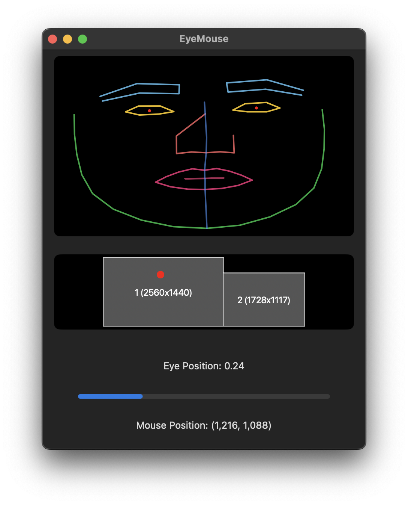

# Eye Mouse

EyeMouseApp is a macOS application that enables hands-free mouse control using eye tracking. The app uses your Mac's built-in camera to track eye movements and allows you to move the mouse cursor between displays by looking left or right.

## Features

- Real-time face tracking with detailed facial mesh visualization
- Eye movement detection for cursor control
- Multi-display support
- Visual feedback system with:
  - Facial landmark highlighting
  - Eye position indicator
  - Mouse position tracking
  - Monitor layout visualization
- Privacy-focused (all processing done locally)

## Requirements

- macOS 11.0 or later
- Mac with built-in camera or compatible external webcam
- Multiple displays (for cursor movement functionality)
- Camera permissions enabled

## Installation

1. Clone the repository or download the source code
2. Open the project in Xcode
3. Build and run the application (⌘R)
4. Grant camera permissions when prompted

## Usage

1. Launch the application
2. Position yourself approximately 1-2 feet from the camera
3. The app will display a facial mesh overlay showing tracking status
4. To move the mouse cursor:
   - Look left (eye position < 0.4) to move cursor to left display
   - Look right (eye position > 0.6) to move cursor to right display
   - A 1-second cooldown applies between movements to prevent accidental triggers

## Interface Elements

The application window contains several components:

1. **Face Mesh View**
   - Shows real-time facial tracking
   - Color-coded feature highlighting:
     - Yellow: Eyes
     - Blue: Eyebrows
     - Pink: Lips
     - Green: Face contour
     - Red: Eye center points

2. **Monitor Layout View**
   - Displays your current monitor configuration
   - Shows real-time cursor position
   - Includes monitor resolutions

3. **Debug Information**
   - Eye position indicator (0.0 - 1.0)
   - Current mouse coordinates
   - Visual progress bar for eye position

## Technical Details

The app uses several key technologies:

- **Vision Framework**: For facial landmark detection
- **AVFoundation**: For camera input processing
- **SwiftUI**: For the user interface
- **Core Graphics**: For custom drawing and visualization
- **Core Video**: For display link handling

## Privacy Considerations

- All processing is done locally on your device
- No data is stored or transmitted
- Camera feed is only used for real-time processing
- Camera access can be revoked through System Settings at any time

## Known Limitations

- Requires good lighting conditions for optimal tracking
- Works best with user facing directly towards camera
- Movement is currently limited to left/right actions
- Requires recalibration if user position changes significantly
- Performance may vary based on system capabilities

## Troubleshooting

1. **Camera Not Working**
   - Check camera permissions in System Settings
   - Ensure no other applications are using the camera
   - Restart the application

2. **Tracking Issues**
   - Ensure adequate lighting
   - Position yourself within optimal range (1-2 feet from camera)
   - Check for obstructions or reflective surfaces
   - Ensure face is fully visible to camera

3. **Cursor Not Moving**
   - Verify multiple displays are connected and configured
   - Check eye position indicator is registering movement
   - Ensure eye movements are sufficient to trigger thresholds

## Contributing

Contributions are welcome! Here are some areas that could use improvement:

- Additional movement controls (up/down, diagonal)
- Customizable sensitivity settings
- Improved tracking algorithms
- Additional accessibility features
- Performance optimizations

## License

MIT

## Acknowledgments

- Vision Framework documentation and examples
- SwiftUI community resources

